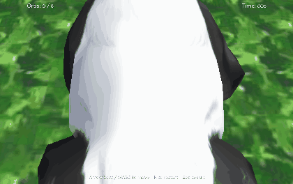

# Panda Collector

A small third-person 3D game built with the [Panda3D](https://www.panda3d.org/)
engine. Guide the panda around the field, collect all the glowing orbs before
the timer runs out, and avoid the roaming hazards.



It uses only the models that ship with Panda3D, so it runs anywhere with a
single `pip install panda3d` — there are no external assets to download.

## Gameplay

- Move the animated panda with a smooth third-person follow camera.
- Collect **8 orbs** before the **60‑second** timer expires to win.
- Touch a roaming **hazard** and it's game over.
- Press **R** to play again.

## Controls

| Key | Action |
| --- | --- |
| `↑` / `W` | Walk forward |
| `↓` / `S` | Walk backward |
| `←` / `A` | Turn left |
| `→` / `D` | Turn right |
| `R` | Restart |
| `Esc` | Quit |

## Running it

```bash
pip install -r requirements.txt   # just Panda3D
python main.py
```

Tested with Python 3.10+ and Panda3D 1.10 / 1.11.

## What it demonstrates

The project is intentionally compact but touches the core parts of a real
Panda3D game:

- **Scene graph & assets** — loading the bundled `environment`, `panda-model`,
  `smiley` and `frowney` models and arranging them under `render`.
- **Animated `Actor`** — the panda plays its `walk` cycle while moving and
  stops when idle.
- **Collision system** — a `CollisionTraverser` with a `CollisionHandlerEvent`
  turns sphere contacts into `orb-hit` / `hazard-hit` events, rather than doing
  ad-hoc distance maths.
- **Third-person camera** — a follow camera that eases in behind the player
  each frame using relative vectors.
- **Task-driven game loop** — a single per-frame `update` task advances
  movement, hazards, the timer and the camera off the frame delta time.
- **Input handling** — key-down / key-up bindings drive a small action-state
  dictionary.
- **On-screen GUI** — `OnscreenText` for the score, timer and win/lose banner.
- **Lighting** — an ambient + directional light rig.

## Project layout

```
panda-collector/
├── main.py            # the whole game (one well-structured ShowBase subclass)
├── requirements.txt
├── LICENSE
└── README.md
```

The code is a single, readable `CollectorGame(ShowBase)` class with each
responsibility (environment, lighting, player, collision, HUD, input, update)
in its own method. Tuning values (field size, orb count, speeds, time limit)
live in constants at the top of `main.py`.

## License

MIT — see [LICENSE](LICENSE).
